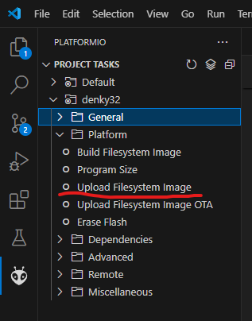
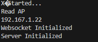
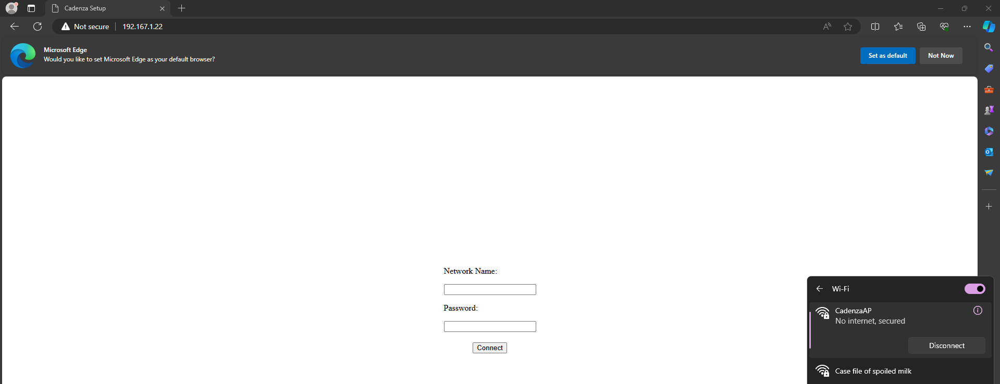
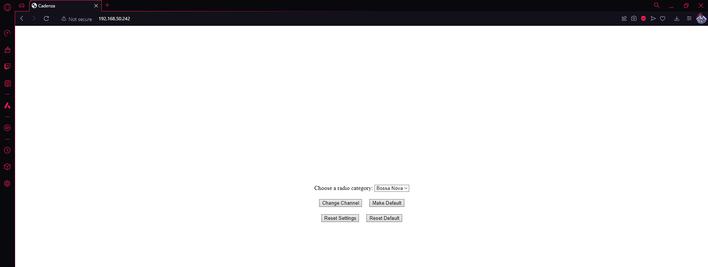

# Cadenza
Open source code for the cadenza project. VERSION 1.0

## What
What is cadenza? Cadenza is a small ESP32 based I2S audio player that allows users to play music through a hosted webserver.

## Why
After applying for a lot of internships and getting rejected from them, I decided to try my hand at a personal project, it was also the perfect excuse to start working on an embedded systems project, something I've been wanting to do for a while now.

## CURRENT VERSION

Code is modular and allows for easy integration.

New class: memoryManager, responsible for reading/writing into memory using preferences

New classes: APServer/WebServer, both implementing the server interface, responsible for abstracting away a little bit of the codebase used for processing data using the websockets

New section in ReadMe for setup purposes

Another new section in ReadMe for video demonstrations 

QOL: Button to restart ESP32 on both servers

## NEXT VERSION

- Small hiatus until Friday, need to study a little bit for the quantum computing workshops

## SETUP
The setup for cadenza is fairly simple (last updated V1.0)

After connections have been made, the files for the webservers need to be uploaded before the code is uploaded.

 Platform.io

WiFi creditentials need to be setup now, this can be done by connecting your serial monitor to Cadenza and observing for the IP address printed. Cadenza will also open an access point (SSID: CadenzaAP, Password: PASSWORD) that you need to connect to.

Fill in internet details and send it to make a connection, keep the serial monitor open to catch the next IP address (operating IP)

Once operating IP is caught (if connected succesfully), you can go ahead and open it in your web browser of choice (as long as you are on the same network or have a way to get there (port forwarding to a home server) )

This guide will be updated when and if steps change

## Demonstrations
This section hosts video demonstrations to features introduced in each version

### Setup

V1

This was my first video ever recorded for a readme/project demonstration. I like the direction I'm moving in as I'm actually using my free time for a passion project 

### Changing channels

V1

This video will most likely change with newer versions, as I'm pretty sure stuff will change as more code gets introduced, but it already feels fulfilling

## Functionalities
Below is a list of promised functionalities with their expected version date. 

### VERSION 1.0

- Cadenza hosts a soft Access Point to allow the user to setup Wifi creditentials
- Cadenza allows the user to control the volume using an analoge input
- Cadenza allows the user to change the radio channel by inputting an web link pointing to a live audio broadcast of that radio channel
- Cadenza allows the user to save a radio channel as default
- Cadenza allows the user the ability to reset settings (saved channels) or configs (network settings)
- Code responsible for cadenza's connectivity is fully commented and built in a modular way

### VERSION 2.0

- Cadenza allows the user to switch music inputs (Radio/Youtube)
- Cadenza allows the user to input a Youtube link and plays the audio from said link
- Cadenza allows the user the ability to input multiple youtube links into a queue
- Cadenza automatically manages the queue as songs finish and feedback is provided to the user
- Users can remove songs from the queue
- Youtube integration is fully modular and commented, allowing for other types of audio to later be integrated

### VERSION 3.0

- Cadenza supports an extra audio source type (Spotify)
- Users can add Spotify songs and create spotify Queues
- General bug fixing and code refactoring where necessary
- Cadenza hosts a better codebase
- Cadenza's readme is fully refactored, featuring code snippits and tutorials on the libraries created for cadenza's usage

### VERSION 4.0

- Cadenza allows the user to mix audio source types into the same queue (Youtube and Spotify only)
- Cadenza is transferred onto a PCB that operates on rechargable power source
- Cadenza's web servers are fully refactored for a more pleasing visual experience
- Cadenza gains a OLED based GUI

